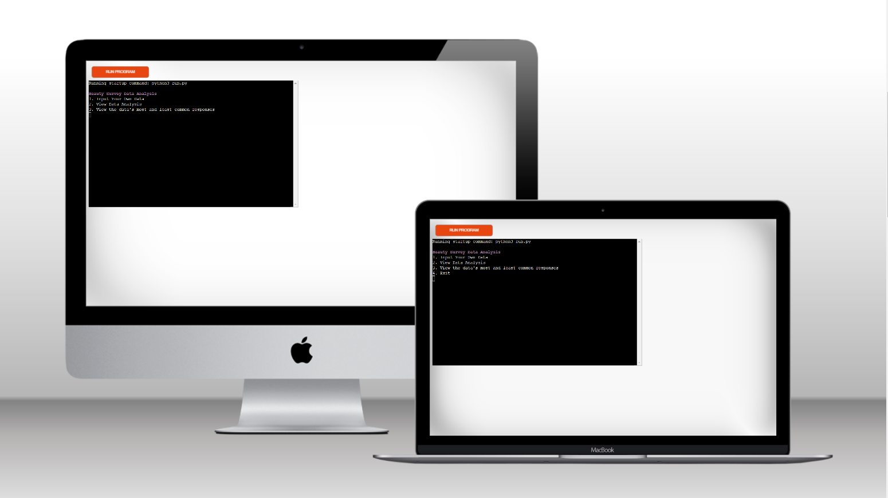
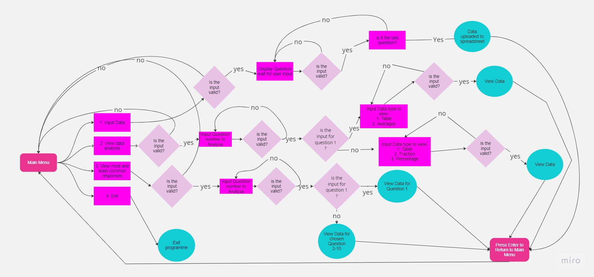
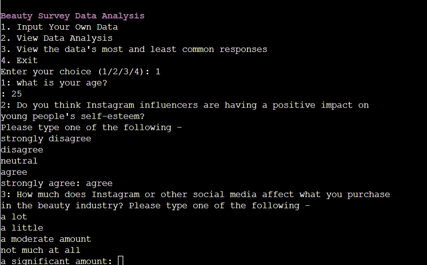
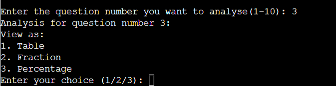
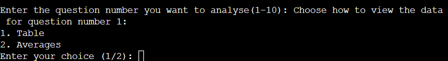
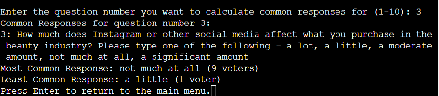
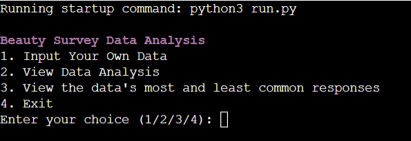
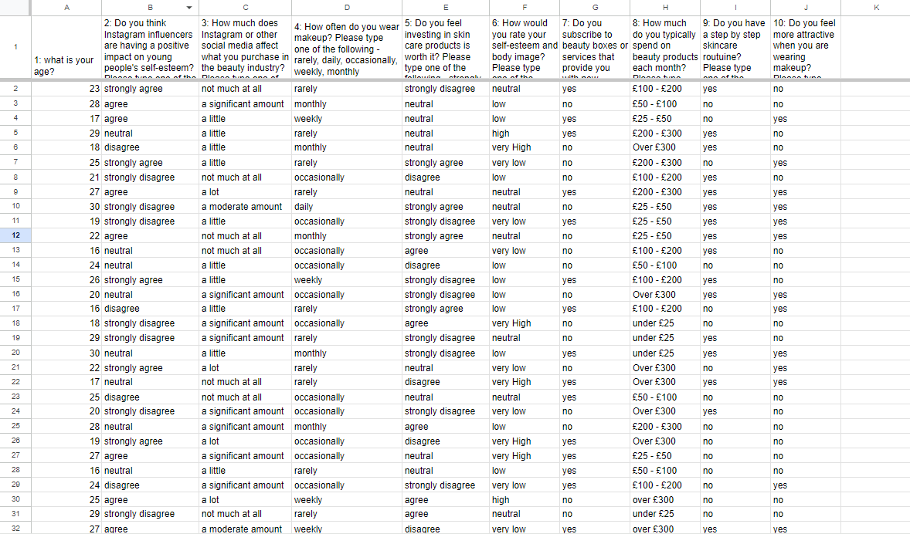
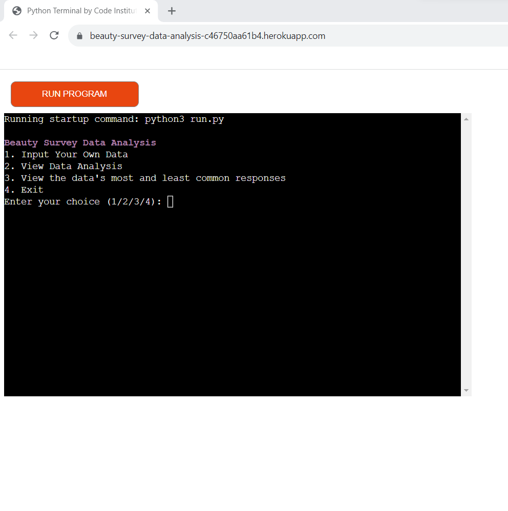
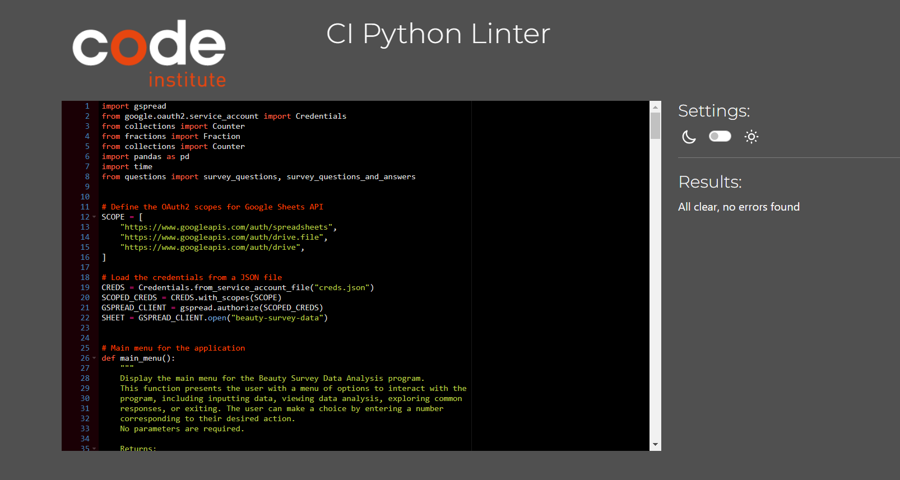

# Beauty Survey Data Analysis
Beauty Survey Data Analysis is a Python program designed to analyze survey data from a beauty-related questionnaire stored in a Google Sheet. This tool provides users with the ability to perform data analysis on 10 specific questions from the survey. It also allows users to contribute their own data by inputting responses into the Google Sheet. Subsequently, they can reanalyze the data, including their own contributions.

[Here is the live version of my project.](https://beauty-survey-data-analysis-c46750aa61b4.herokuapp.com/)

## Table of contents 
- [Flow Chart](#flow-chart)

- [How to use](#how-to-use)

- [Features](#features)

- [Libraries/ Imports used](#libraries-imports-used)

- [Testing](#testing)

- [Deployment](#deployment)

- [Credits](#credits)

### Flow Chart 

## How to Use
The Beauty Survey Data Analysis program offers a versatile and intuitive user experience through a series of interactive menus and prompts. Users can seamlessly navigate various tasks within the program:

### Menu-driven Interaction:

- Upon launching the program, users are presented with a menu featuring multiple options, providing clear paths for data input and analysis.

### Data Input:

- Option 1 allows users to input their own survey data. They are guided through ten specific questions with predefined response options.
The program ensures data accuracy, enhancing user experience and data integrity.

### Data Analysis:

- Users can select option 2 to initiate the data analysis process. They can choose one of the ten survey questions for detailed examination.
The program then prompts users to specify their preferred method of viewing the data, which includes Table, Percentage and Fractions

### Common Responses Analysis:

- Option 3 empowers users to delve into common responses across the survey questions. Users can select a specific question of interest.
and both the most and least common answers will be shown with their response count.

### User-Friendly Iteration:

- After completing each task, users are given the opportunity to seamlessly return to the main menu. This flexibility enables users to perform additional actions, ensuring a productive workflow.

### Program Termination:

- Users can choose option 4 when at the main menu (which they can be taken to by pressing enter at the end of each action), to exit the program gracefully.

- The Beauty Survey Data Analysis program prioritizes user interaction and feedback, enhancing data collection and analysis capabilities. This structured approach to interaction and data management ensures an effective and efficient user experience.

## Features

### Live Data Input Feature

 The "Data Input" feature of this program enables users to conveniently input survey data. Here's how it works:

- Interactive Survey Questions: 
    - Users are presented with a set of predefined survey questions, each with a specific format and response options. The questions cover     various aspects of the beauty industry, from age and makeup habits to the impact of social media.

- Data Validation: 
    - The program ensures data validity by checking responses against predefined options for each question. For example, it verifies that age is an integer and that responses for other questions align with the provided choices. 

- Real-Time Data Contribution:
    - As users input their data, it becomes part of the dataset in real-time. This dynamic feature allows users to include their responses in any future analyses they choose to perform.   

- User-Friendly Interface: 
    - The interactive interface guides users through the input process, making it accessible to individuals with various levels of technical proficiency.
    
 

 The "Data Input" feature provides a simple, user-centric way to contribute to the dataset and utilize your survey data effectively. It ensures that users' inputs are immediately integrated into the program's database, enhancing the depth and richness of the dataset.

### Data Analysis Feature

The "Data Analysis" feature empowers users to explore the survey dataset and gain insights into the collected responses

- Comprehensive Data Viewing: 
    - Users can choose any of the 10 survey questions to analyze. For each question, they will be prompted to decide how they want to view the data.

- Multiple Data Viewing Modes:

    - Table View: Users can select this mode to see the distribution of responses as a table. This is particularly helpful for questions with multiple response options.

    - Fraction View: For questions 2 -10, users can choose this mode to view data as fractions, providing a precise breakdown of responses for each option.

    - Percentage View: For questions 2 -10, and For a quick overview, users can opt for this mode to see response percentages for each option.

    

- Special Treatment for Question 1: For the first question, which collects age data (an integer), the fraction and percentage options being taken away and an additional feature has been added:

    - Table View: Users can visualize the distribution of ages as a table.
    - Averages: Users can view statistics such as the average age, youngest age, and oldest age among respondents.

    

- User-Friendly Interface
    - The interface guides users through the process of choosing a question and their preferred mode of data presentation.
    -  The feature allows users to explore the dataset and gather valuable insights, enabling data-driven decision-making.

The enhanced "Data Analysis" feature provides a versatile and informative way to explore survey responses. Users can choose their preferred viewing mode and access specialized statistics for the age question, making it a versatile tool for analyzing survey data effectively.

### Common Responses Analysis

The "Common Responses Analysis" feature allows users to investigate the most and least common responses for each survey question. This feature provides users with a deeper understanding of the prevailing trends and outliers within the dataset.

- Select Any Question: 
    - Users can choose from any of the 10 survey questions for which they wish to analyze common responses.
    
- Insightful Analysis: 
    - The feature helps users understand the dominant and less frequent responses to each question, allowing for informed decision-making.

- Accessibility:
    - The user-friendly interface and clear options make it easy for users to explore and analyze common responses.

The "Common Responses Analysis" feature is a valuable tool for users who want to identify trends and variations within the survey dataset. It enables users to gain a comprehensive understanding of how respondents answer each question, making it easier to draw insights and conclusions from the data.

### User-Friendly Main Menu

The "User-Friendly Main Menu" is designed to provide an intuitive and accessible interface for users. It is the starting point of the program and allows users to navigate through different functionalities seamlessly, Key features of the "User-Friendly Main Menu" include:

- Interactive Navigation:
    - After each task or operation, users can return to the main menu by simply pressing the "Enter" key. This user-friendly navigation ensures a smooth and efficient user experience.

- Choice and Flexibility:
    - Users have the freedom to choose how they interact with the program. Whether they want to input their data, explore data analysis, or analyze common responses, the main menu offers clear options to meet their needs.

 The "User-Friendly Main Menu" serves as the central hub for the program, allowing users to decide how they want to interact with the survey data. Its intuitive design ensures that users can easily navigate through different functionalities, contributing to a user-friendly and efficient experience.

### Graceful Program Exit

The "Exit" option within the program provides a graceful way for users to conclude their session. This feature ensures that users can conveniently exit the program and return to their operating system or environment.

- User Control: 
    - Users have the autonomy to exit the program at any point by selecting the "Exit" option from the main menu.
    - Clean Termination: When chosen, the program will execute a clean and orderly termination process, preventing abrupt closures or data loss.

The "Graceful Program Exit" feature is an essential part of the program, offering users a convenient and user-friendly way to conclude their session without any unexpected interruptions. This ensures a smooth user experience and maintains the integrity of the program's operation.

### Interactive Interface

The program is designed with a user-friendly, menu-driven interface that makes it accessible and intuitive for users with varying levels of technical expertise. This interactive interface allows users to easily navigate the program and perform key functions. Here are the core elements of this feature:

- Main Menu: 
    - Upon starting the program, users are presented with a main menu that displays a list of available options. This menu serves as the central hub for all interactions with the program.

- Option Selection: 
    - Users can choose from a set of numbered options presented in the main menu. Each option corresponds to a specific task or action within the program.

- Clear Prompts: 
    - The program provides clear and concise prompts, guiding users on how to proceed. These prompts ensure that users understand their choices and can make informed selections.

- Input Validation:
    - User inputs are validated to ensure that they meet the program's requirements. If an invalid input is provided, the program provides feedback and allows the user to re-enter the information.

- Repeatable Interactions: 
    - Users can interact with the program repeatedly, choosing different options and performing various tasks without the need to restart the application.

    The interactive interface is a fundamental feature of the program, making it accessible and easy to use for a broad audience. Users can navigate through the menu, input data, perform data analysis, explore common responses, and gracefully exit the program, all with a straightforward and responsive interface. This user-centric approach enhances the overall experience and encourages users to engage with the program's capabilities effectively.

### Data Persistence

One of the key features of the program is data persistence. This means that the data you enter is stored and retained for future use, allowing you to reference, analyze, or build upon it in subsequent interactions. Here's how data persistence is implemented in the program:

- Data Storage: 
    - When you enter survey responses or other data, the program securely stores this information. Data is organized and stored in a structured format, ensuring that it remains intact and easily accessible.

- Reference in Future Analyses: 
    - Any data you input becomes a part of the program's dataset. This dataset is available for future data analysis. If you choose to analyze the data, it includes all previously entered information, providing a comprehensive view of the dataset over time.

- Seamless User Experience: 
    - Data persistence ensures a seamless user experience. You can input data during one session, exit the program, and return at a later time to continue your analysis or input additional information. Your previous data is readily available for your reference.

- Data Security: 
    - Data persistence is implemented with a focus on security. Your data is stored securely, and privacy considerations are taken into account. The program does not share or expose your data to external sources.

The data persistence feature enhances the program's functionality and value. It ensures that the information you input is not temporary but a valuable resource that can be used for ongoing analysis, comparisons, and reference. This feature provides a sense of continuity and convenience for users who want to track their data over time and derive insights from it.

### Flexible Data Viewing

The program offers a flexible data viewing feature that allows you to choose how you want to visualize and analyze the data. Whether you prefer tables, fractions, or percentages, the program adapts to your analytical needs. Here's how the flexible data viewing feature works:

- Table View: 
    - When analyzing survey data, sometimes a tabular format is the most convenient. The program provides a table view that displays the data in an organized and easy-to-read format. This view is particularly useful when you want to see responses and their corresponding counts in a structured layout.

- Fractional Representation:
    - For a more detailed analysis, the program offers the option to view responses as fractions. This feature calculates the fraction of each response option based on the total number of responses. It provides a more granular view of the data, allowing you to understand the distribution of responses more precisely.

- Percentage Representation:
    - Another way to view the data is as percentages. This representation converts response counts into percentages, providing an easy-to-understand measure of how common each response is within the dataset. Percentages are particularly useful for gauging the relative popularity of response options.

- Question-Specific Analysis: 
    - Depending on the question you're analyzing, you might be presented with different viewing options. For instance, if you're looking at question 1 (about age), you have the different choice of viewing averages, including the youngest, oldest, and average age. This specialized analysis option is tailored to the nature of the question.
 
- Most and Least Common Answers:
    - Quickly discern the prevailing and infrequent choices for each survey question. This feature enables you to gain insights into the distribution of responses, helping you understand popular trends and unique perspectives within the data.

The flexible data viewing feature is designed to cater to various analytical requirements. It empowers you to choose the representation that best suits your needs. Whether you need a quick overview in table format, a detailed breakdown in fractions, or a clear perspective in percentages, the program ensures that you can view the data in the most relevant and informative way. This adaptability enhances the program's usability and makes it a versatile tool for data analysis.

### Heroku Deployment Feature:

- Access the program via a web-based interface.
- No local installations or dependencies required.
- Enhance accessibility and usability for a wide range of users.
- Data and analyses are available for quick reference and usage.
- Enjoy the convenience of running the program online.

### Future Feature Ideas:

- Data Comparison: Implement the ability to compare responses to different questions, allowing users to identify correlations or patterns within the data.

- Advanced Data Visualization: Explore options for visualizing survey data with charts, graphs, or plots to gain deeper insights.

- Export Data: Provide users with the option to export data and analyses in various formats (e.g., CSV, PDF) for external use.

- User Accounts: Create user accounts and profiles, allowing users to save their data and analyses, and retrieve them in future sessions.

- Interactive Charts: Develop interactive charting tools to enable users to create custom visualizations for data analysis.

- Custom Surveys: Allow users to create custom surveys with their own questions and response options.

- Data Filters: Implement data filtering capabilities to focus on specific subsets of responses.

- Export Reports: Generate and export comprehensive reports with summaries, insights, and visualizations.

- Machine Learning Integration: Explore the integration of machine learning algorithms to derive predictive or analytical insights from the data.

These future feature ideas can demonstrate your program's potential for growth and improvement, and they may attract contributors or collaborators interested in extending its functionality.

## Libraries/ Imports used

- Gspread:

    - Purpose: I use the gspread library to interact with Google Sheets. It allows my program to read, write, and manipulate data stored in Google Sheets. In this project, it's essential for connecting to the Google Sheets document where the survey data is stored.

- Google.oauth2.service_account.Credentials:

    - Purpose: I utilize the Credentials class from the google.oauth2.service_account module to load and manage the credentials required to authenticate my application with Google services. In this case, it's used to authenticate and authorize access to my Google Sheets document.

- Collections.Counter:

    - Purpose: I make use of the Counter class from the collections module to count the occurrences of elements in a sequence. In my project, it is employed to tally the responses to each survey question and calculate the most and least common responses for analysis.
    
- Fractions.Fraction:

    - Purpose: The Fraction class from the fractions module is used for precise fractional arithmetic. I apply it to calculate and display the response percentages when analyzing survey data.

- Pandas as pd:

    - Purpose: I use the pandas library for data manipulation and analysis. It simplifies working with data as DataFrames, making tasks like creating tables to display survey data, responses, and their counts more straightforward.

- Time:

    - Purpose: I include the time module, providing functions to work with time-related operations. In my project, it's employed to introduce time delays (e.g., using time.sleep()) to control the pacing of output when displaying survey questions to the user.

## Testing 

To maintain the functionality and reliability of the "Beauty Survey Data Analysis" application, comprehensive testing has been performed. The testing process covers various aspects of the application, including input validation, data analysis, and common response calculations. These have been tested in both the local terminal and the deployed heroku terminal. Here is an overview of the testing procedures and outcomes:

### Input Data Testing

- Data Validation: 
    - The application validates user input for each survey question. Testing was performed to ensure that only valid responses are accepted, preventing incorrect data from being stored in the Google Sheets document.

### Input option testing

- Input Validation:
    - In order to ensure a robust and user-friendly experience, I've incorporated a while loop within the user input sections of the program. This loop acts as a guardian, preventing the program from breaking when users input an invalid option when prompted. Instead of terminating, the program will gracefully persist within the loop, repeatedly prompting users for a valid input until one is provided. This ensures that the user can't accidentally derail the program with an incorrect choice, maintaining a seamless and error-tolerant interaction.

### Data Analysis Testing

- View Data Analysis:
    - Users can select specific survey questions for analysis. The application provides options to view data as tables, fractions, or percentages. Testing verified that the chosen analysis method accurately represents the survey responses.

- Averages Calculation:
    - For Question 1, the application calculates the average age, youngest age, and oldest age based on user responses. Testing ensured that these calculations are correct and provide meaningful insights.

### Common Response Testing

- Most and Least Common Responses: 
    - Users can choose a survey question to find the most and least common responses. The application calculates these responses accurately and presents the results. Extensive testing confirmed the correctness of these calculations.

### Menu-Driven Interface Testing

- Main Menu Navigation:
    - The main menu is a critical part of the application. Testing covered menu navigation, user choices, and error handling to guarantee a smooth and user-friendly experience.

### Code Validation 

- Passed code through a PEP8 linter with no issues

### Bugs / Problems

- Initially, the "Beauty Survey Data Analysis" application was designed to offer users visual insights into the survey data, utilizing charts and graphs. However, during the deployment on Heroku, a challenge arose as the visual components, like chart windows, didn't open as expected. This unforeseen issue prompted a shift in the application's data analysis strategy.

- To adapt to the limitations on the Heroku platform, a revised approach was devised. The focus transitioned from visualizations to a more practical and versatile method – the calculation of most and least common responses. This decision proved to be highly effective in providing users with valuable insights into survey data. The shift in strategy not only resolved the technical challenges but also contributed to an improved structure and user experience.

### Reamining Bugs

- No remaining bugs to fix

The testing process included both unit testing and user acceptance testing (UAT) to assess the application from a user's perspective. Additionally, edge cases and invalid inputs were tested to ensure that the application handles unexpected scenarios gracefully. The "Beauty Survey Data Analysis" application has undergone rigorous testing to provide users with a reliable and accurate platform for survey data analysis.

## Deployment 

Beauty Survey Data Analysis was deployed using Code Institute's mock terminal for Heroku. 

- I deployed my project with the following steps - 

- Create the Heroku App:

    - Logged into my Heroku account and accessed the dashboard.
    Clicked "Create new app," named it uniquely, and selected the region.
    Clicked "Create app."

- Configure the App:

    - Navigated to the app's settings tab.
    Created a CREDS variable to store sensitive data like creds.json.
    Pasted the creds.json content into the CREDS variable.

- Add Buildpacks:

    - In the app's settings, added Python and Node.js buildpacks in the correct order.

- Deploy the Code:

    - Chose the deployment method as Github.
    Connected my Heroku app to my Github repository.

- Choose Deployment Method:

    - Opted for "Automatic Deploys" (This means every time a change is pushed to gitHub, Heroku will re build and deploy the app.)

- Deploy the App:

    - Clicked "Deploy Branch" and monitored the deployment logs.

- Test the App:

    - Ensured the app functioned as expected with test data.

- Completion:

   - Successfully deployed the "Beauty Survey Data Analysis" project on Heroku, making it accessible via the provided link.

- This deployment process allowed me to make my project available to a broader audience and enhance my portfolio.

## Credits 

- I used the website Stack Overflow for help and advice throughout the project.

- I used the love sandwiches project to help me set up the API from my project to Google sheets.

- I used Google to help me with some of the questions and how to generate random answers in a speadsheet.

- My mentour, Derek McAuley helped me with how to display the questions slower and gave me the idea of using a while loop to ensure the user inputs are correct and do not crash the programme.